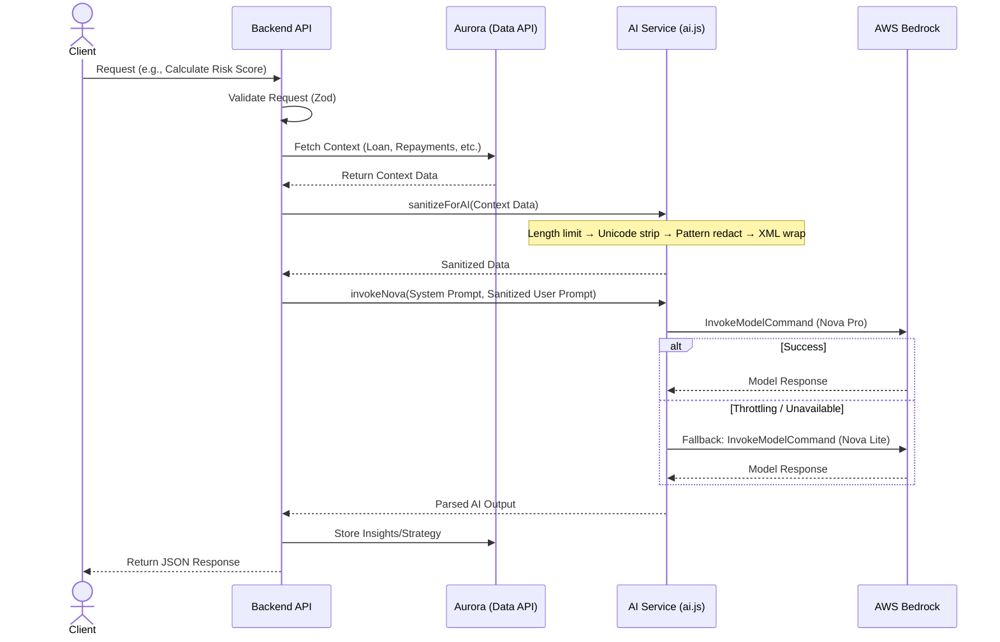

# AI Engine Documentation

This document describes the AI engine integrated into the backend, its primary functions, and its operational workflow. The AI engine is built using AWS Bedrock and leverages Amazon's Nova models for intelligent insights and strategy generation.

## Overview

The AI engine uses **Amazon Nova Pro (`amazon.nova-pro-v1:0`)** as its primary model via the `@aws-sdk/client-bedrock-runtime` library. Serverless foundation models are automatically enabled across all AWS commercial regions upon first invocation, eliminating the need for manual model activation in the AWS console. It includes an automatic fallback to **Amazon Nova Lite (`amazon.nova-lite-v1:0`)** in case of service throttling or unavailability.

## Core Functions

### 1. Security and Sanitization (`sanitizeForAI`)

All user-supplied data passed to AI models is sanitized through multiple defense layers to mitigate prompt injection attacks:

#### Layer 1: Input Length Limiting
Inputs exceeding 50,000 characters are truncated to prevent abuse via excessively large payloads.

#### Layer 2: Unicode Normalization
Strips dangerous invisible characters that attackers use to obfuscate injections:
- Zero-width characters (`U+200B`, `U+200C`, `U+200D`, `U+FEFF`, `U+00AD`)
- Bidirectional override marks (`U+202A`–`U+202E`, `U+2066`–`U+2069`)
- Invisible formatting characters (`U+2060`–`U+2064`)

#### Layer 3: Pattern-Based Redaction
Over 30 regex patterns detect and redact known injection techniques, organized by attack category:

| Category | Examples Detected |
| :--- | :--- |
| **Instruction Override** | `ignore all previous instructions`, `disregard prior prompts`, `forget earlier rules`, `override previous context` |
| **Role Hijacking** | `you are now a/an`, `act as if`, `pretend you are`, `switch to new role/persona` |
| **Mode Switching** | `enter developer/admin/root/sudo/debug/jailbreak/DAN mode` |
| **DAN Jailbreak** | `do anything now`, `DAN` patterns |
| **Delimiter Injection** | `system:`, `user:`, `assistant:`, `[INST]`, `[/INST]`, `<<SYS>>`, `<\|im_start\|>`, `<\|endoftext\|>` |
| **Data Exfiltration** | `reveal/show/repeat/output/print your system prompt/instructions/rules` |
| **Encoding Tricks** | `base64 encode/decode`, `rot13`, `hex encode/decode`, `translate from base64` |
| **Suspicious Terms** | `prompt injection`, `jailbreak` |

All matches are replaced with labeled markers like `[REDACTED:ROLE_HIJACK]` for auditability.

#### Layer 4: XML Boundary Wrapping
Sanitized data is wrapped in `<data>...</data>` XML tags to clearly delineate user-supplied content from system instructions, preventing delimiter confusion.

### 2. Model Invocation (`invokeNova`)
This function handles the API calls to AWS Bedrock. It requires a `systemPrompt` to instruct the AI and a `userPrompt` with the sanitized data context. 
- The model temperature is set to `0.7` with a `topP` of `0.9` for a balanced creative and deterministic response.
- `maxTokens` is limited to `2000`.

## Handlers Using the AI

### Risk Score Calculation (`calculateRiskScore`)
Evaluates the default risk of a borrower.
- **Inputs:** Loan details and historical repayment schedule.
- **AI Task:** Acts as a senior financial risk analyst to calculate a dynamic risk score (0-100) and provide a concise reasoning based on payment trends, delays, and liquidity signals.
- **Output:** JSON containing the `risk_score` and `reasoning`, which is then stored in the `ai_insights` table.

### Strategy Generation (`generateStrategy`)
Generates a recovery strategy for borrowers at risk of default.
- **Inputs:** Loan details and the current risk score.
- **AI Task:** Acts as a specialized loan recovery strategist. It creates an empathetic yet firm recovery plan, including a summary of the situation, recommended outreach channels, a restructuring plan, and a draft message for the borrower.
- **Output:** Markdown formatted strategy document stored in the `strategies` table.

## Workflow Description

The sequence of operations from a client request through the AI engine is illustrated below.

